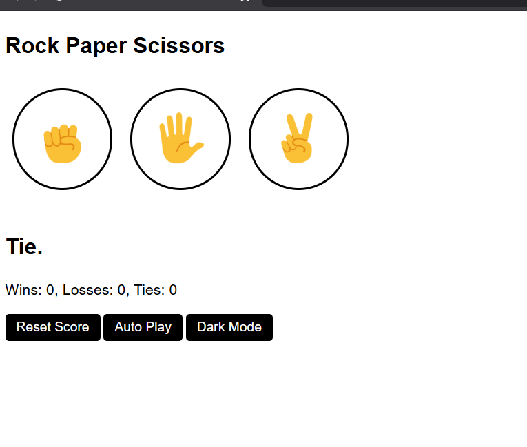

# Rock Paper Scissors

## Description
This is a simple Rock Paper Scissors game built using HTML, CSS, and JavaScript. The game includes features like score tracking, autoplay, and a dark/light mode switch.

## Features
- Uses **localStorage** to store, display, and delete past scores (`setItem`, `getItem`, `removeItem`).
- Utilizes **DOM manipulation** to display scores, player moves, and computer moves.
- Three buttons for selecting **Rock**, **Paper**, or **Scissors**.
- A **dark/light mode toggle** for switching between themes, similar to popular apps.
- Supports **keyboard controls** using event listeners:
  - Press `R` or `r` for **Rock**
  - Press `P` or `p` for **Paper**
  - Press `S` or `s` for **Scissors**
- **Score reset confirmation** to prevent accidental resets.
- **Auto Play** mode where the computer plays automatically until stopped.

## How to Play
1. Click one of the **Rock, Paper, or Scissors** buttons OR use the keyboard shortcuts:
   - `R` for **Rock**
   - `P` for **Paper**
   - `S` for **Scissors**
2. The computer randomly selects a move, and the game determines the winner.
3. The **scoreboard** updates automatically.
4. Click **Reset Score** to reset the scores.
   - A confirmation message will pop up before resetting.
5. Click **Auto Play** to let the computer play by itself.
   - The button text changes to **Stop Auto Play** when enabled.
   - Click again to stop autoplay.
6. Click **Light Mode/Dark Mode** to toggle between dark and light themes.

## Technologies Used
- **HTML**
- **CSS**
- **JavaScript** (ES6+)

## Screenshots
### Dark Mode:

### Light Mode:

## Future Improvements
- Add sound effects for move selections.
- Implement a multiplayer mode.
- Add animations to enhance user experience.

## Author
**[Rosis Sharma]** - [GitHub Profile](https://github.com/rosheesh7)
